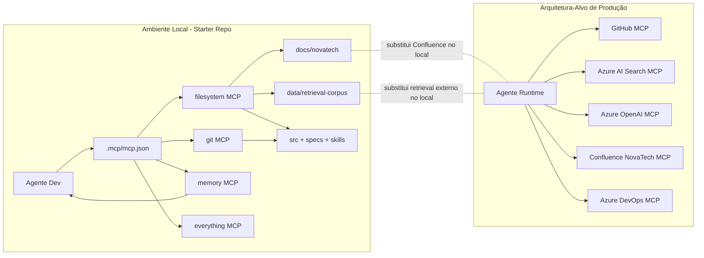

# Arquitetura MCP — NovaTech Assistant (Exercício 2.2)

## Fase A — Alinhamento de Escopo
- Entregar arquitetura MCP com separação explícita entre ambiente de produção (alvo) e ambiente local (starter repo).
- Entregar catálogo de servers autorizados e regras de governança (aprovação, permissões, versionamento, monitoramento).
- Entregar diagrama Mermaid com fluxo de consumo por agentes e serviços.
- Entregar script funcional de health check para o contexto local usando `.mcp/mcp.json` como fonte primária.
- Entregar prompt curto para Copilot implementar/ajustar o health check.
- Entregar plano de contingência com gatilhos, fallback, owner e decisão de bloqueio/continuidade.
- Não assumir disponibilidade local de Azure, GitHub remoto, Confluence ou Azure DevOps.
- Não inventar caminhos fora de `.mcp/mcp.json`, `.mcp/mcp.example.json`, `docs/novatech/`, `data/retrieval-corpus/`, `src/`, `specs/`, `skills/`.

## 1) Visão Geral
- Regra: MCP servers são infraestrutura versionada e aprovada, nunca configuração ad-hoc por tarefa.
- Justificativa: reduz risco operacional, de segurança e de drift entre ambientes.
- Critério de verificação: toda alteração de server/tool/resource ocorre por mudança versionada no repositório.

- Regra: a arquitetura deve separar explicitamente o alvo de produção da execução local do starter repo.
- Justificativa: o cenário local não possui dependências remotas obrigatórias.
- Critério de verificação: cada seção crítica identifica diferenças entre produção e local.

Produção (alvo):
- servers gerenciados para GitHub, Azure AI Search, Azure OpenAI, Confluence NovaTech, Azure DevOps.

Local (executável hoje):
- servers locais `filesystem`, `git`, `memory`, `everything` definidos por `.mcp/mcp.example.json`, com ativação real em `.mcp/mcp.json`.
- substituições locais:
  - `docs/novatech/` substitui conteúdo de Confluence.
  - `data/retrieval-corpus/` substitui fonte de retrieval externo.

## 2) Catálogo de Servers Autorizados

### 2.1 Produção (alvo)

#### Server: GitHub MCP
- Ambiente: produção
- Finalidade: leitura de código e metadados de PR; criação de PR em fluxo controlado.
- Consumidores: agentes de desenvolvimento, Tech Lead, Delivery.
- Tools expostas (mínimo): leitura de arquivo, busca de código, criação/atualização de PR.
- Resources expostos: repositórios autorizados da organização.
- Prompts expostos: opcionais para review/checklist.
- Criticidade: alta
- Permissão mínima: read por padrão; write apenas em automações aprovadas.

#### Server: Azure AI Search MCP
- Ambiente: produção
- Finalidade: consulta ao índice de conhecimento para retrieval.
- Consumidores: agentes de atendimento e pipelines de query.
- Tools expostas (mínimo): query/read index.
- Resources expostos: índices de conhecimento aprovados.
- Prompts expostos: nenhum obrigatório.
- Criticidade: alta
- Permissão mínima: query/read; write de índice proibido para agentes de atendimento.

#### Server: Azure OpenAI MCP
- Ambiente: produção
- Finalidade: completion/chat completion com políticas do projeto.
- Consumidores: serviços de geração de resposta.
- Tools expostas (mínimo): completion API.
- Resources expostos: deployments/modelos aprovados.
- Prompts expostos: templates controlados em `prompts/`.
- Criticidade: alta
- Permissão mínima: invoke de deployment específico; sem permissões administrativas.

#### Server: Confluence NovaTech MCP
- Ambiente: produção
- Finalidade: leitura de documentação corporativa.
- Consumidores: agentes de suporte e documentação.
- Tools expostas (mínimo): read page/search page.
- Resources expostos: spaces autorizados.
- Prompts expostos: nenhum obrigatório.
- Criticidade: média
- Permissão mínima: read-only.

#### Server: Azure DevOps MCP
- Ambiente: produção
- Finalidade: leitura/escrita de work items em fluxos aprovados.
- Consumidores: Delivery Manager, automações de planejamento.
- Tools expostas (mínimo): read/write work items.
- Resources expostos: projetos e boards autorizados.
- Prompts expostos: templates de atualização de status.
- Criticidade: média-alta
- Permissão mínima: read por padrão; write com escopo de projeto e trilha de auditoria.

### 2.2 Local (starter repo)

#### Server: filesystem
- Ambiente: local
- Finalidade: leitura/edição de código e docs locais.
- Consumidores: agentes de desenvolvimento.
- Tools expostas: leitura/escrita/listagem local.
- Resources expostos: `src/`, `specs/`, `skills/`, `docs/`, `data/`.
- Prompts expostos: não aplicável.
- Criticidade: alta
- Permissão mínima: escopo restrito aos diretórios explicitados na config.

#### Server: git
- Ambiente: local
- Finalidade: histórico/branches no repo local.
- Consumidores: agentes de desenvolvimento e revisão.
- Tools expostas: status/log/diff/branch operations.
- Resources expostos: repositório local (`.`).
- Prompts expostos: não aplicável.
- Criticidade: média-alta
- Permissão mínima: leitura por padrão; operações destrutivas proibidas por política.

#### Server: memory
- Ambiente: local
- Finalidade: memória persistente para decisões e glossário.
- Consumidores: agentes com contexto de longo prazo.
- Tools expostas: leitura/escrita de memória.
- Resources expostos: grafo local do servidor.
- Prompts expostos: não aplicável.
- Criticidade: média
- Permissão mínima: escopo restrito ao workspace/projeto.

#### Server: everything
- Ambiente: local
- Finalidade: aprendizado/inspeção de primitivas MCP.
- Consumidores: agentes em exploração técnica.
- Tools expostas: recursos de referência do server.
- Resources expostos: internos do server.
- Prompts expostos: não aplicável.
- Criticidade: baixa
- Permissão mínima: leitura e execução não destrutiva.

## 3) Diagrama de Conexões

## 4) Política de Aprovação de Novo MCP Server
- Regra: proposta de novo server deve ser aberta pelo Tech Lead ou responsável de domínio via PR.
- Justificativa: centraliza responsabilidade técnica.
- Critério de verificação: PR contém seção "Proposta de MCP Server".

- Regra: revisão obrigatória de Segurança + Tech Lead + owner consumidor.
- Justificativa: evita exposição indevida de dados e tools.
- Critério de verificação: aprovações registradas no PR antes de merge.

- Regra: evidências mínimas obrigatórias:
  - caso de uso real (qual tarefa desbloqueia),
  - matriz de permissões (read/write),
  - impacto por indisponibilidade,
  - teste local (quando aplicável),
  - plano de rollback.
- Justificativa: aprovação baseada em risco/valor.
- Critério de verificação: checklist preenchido no PR.

- Regra: decisão deve ser registrada em ADR e changelog de MCP.
- Justificativa: rastreabilidade.
- Critério de verificação: referência no PR para documento em `docs/adr/` e para changelog versionado.

- Regra: configuração deve ser versionada em `.mcp/`.
- Justificativa: evita drift manual.
- Critério de verificação: mudança de configuração somente via commit.

## 5) Política de Permissões (Least Privilege)
- Regra: padrão é read-only; write é exceção explícita e temporal.
- Justificativa: minimiza blast radius.
- Critério de verificação: matriz de permissões por ambiente e server.

- Regra: separar credenciais por ambiente (dev, CI, produção), sem reuso.
- Justificativa: reduz risco de escalonamento entre ambientes.
- Critério de verificação: secrets/config por ambiente e rotação independente.

- Regra: write permitido apenas para fluxos aprovados:
  - GitHub: criação/atualização de PR em branches autorizadas.
  - Azure DevOps: update de work items no escopo do projeto.
- Justificativa: governança de mudança.
- Critério de verificação: trilha de auditoria e logs de operação.

- Regra: em ambiente local, escopo do filesystem deve listar diretórios explícitos e não usar raiz irrestrita.
- Justificativa: proteção contra acesso indevido.
- Critério de verificação: `.mcp/mcp.json` contém args de paths permitidos.

## 6) Monitoramento e Observabilidade
Sinais mínimos por server:
- indisponibilidade: server não inicializa/comando ausente.
- latência anormal: acima de limiar definido por tipo de server.
- resposta estrutural inválida: payload sem campos esperados.
- resposta semanticamente incorreta/desatualizada: conflito com fonte vigente.
- drift de configuração: diferença entre baseline aprovado e ambiente ativo.

Cadência:
- Local: health check a cada execução de workflow sensível e em PR que altera `.mcp/`.
- Produção: health check contínuo (intervalo curto) + validação semântica periódica.

Owner:
- Tech Lead: baseline arquitetural e drift.
- Platform/Infra: disponibilidade e latência.
- Produto/Knowledge owner: validade semântica da documentação.

Notificação:
- Local: saída do script + falha de pipeline local.
- Produção: alerta em canal operacional e abertura automática de incidente.

Falha crítica vs degradável:
- crítica: server necessário para fluxo principal indisponível sem fallback seguro.
- degradável: server auxiliar indisponível com fallback local/manual aprovado.

## 7) Versionamento e Compatibilidade
- Regra: versionar config MCP no repositório (`.mcp/mcp.json`) com changelog dedicado.
- Justificativa: rastreabilidade de alterações.
- Critério de verificação: toda mudança de config acompanha nota de versão.

- Regra: breaking change requer janela de transição com fallback.
- Justificativa: continuidade operacional.
- Critério de verificação: PR inclui plano de migração e rollback.

- Regra: validar localmente antes de rollout (script health check + smoke test de tools críticas).
- Justificativa: detectar falhas cedo.
- Critério de verificação: evidência de execução anexada ao PR.

- Regra: remoção/alteração de tool/resource deve ter mapeamento substituto ou bloqueio explícito da feature dependente.
- Justificativa: evita falha silenciosa.
- Critério de verificação: matriz de dependências atualizada.

## 8) Tecnologia do Health Check
Escolha: PowerShell (`scripts/mcp-health-check.ps1`).

Justificativa curta:
1. O ambiente de execução do exercício é Windows e o starter já roda localmente sem dependências adicionais.
2. PowerShell permite validar JSON, executáveis e caminhos locais de forma nativa.
3. Integra bem com CI local via exit code e output textual legível.
