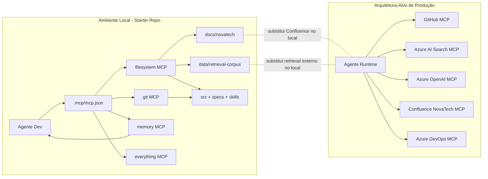

# 1. Arquitetura MCP

## Alinhamento de Escopo
- Entregar arquitetura MCP com separação explícita entre produção (alvo) e ambiente local do starter repo.
- Entregar governança de MCP (aprovação, permissões, monitoramento, versionamento, compatibilidade).
- Entregar diagrama Mermaid separando local e produção.
- Entregar health check local funcional baseado em `.mcp/mcp.json`.
- Entregar plano de contingência com gatilhos, fallback, owner e regra de bloqueio/continuidade.
- Não assumir disponibilidade local de Azure, GitHub remoto, Confluence ou Azure DevOps.

## Visão Geral
- Regra: MCP server é infraestrutura versionada e aprovada, não configuração ad-hoc.
- Justificativa: reduz risco de segurança, drift e instabilidade operacional.
- Critério de verificação: alteração de server/tool/resource só via mudança versionada no repositório.

- Regra: Produção e local devem ser tratados como arquiteturas diferentes.
- Justificativa: o starter repo local não tem dependências remotas obrigatórias.
- Critério de verificação: cada parte crítica explicita comportamento em produção e local.

Produção (alvo):
- GitHub, Azure AI Search, Azure OpenAI, Confluence NovaTech, Azure DevOps.

Local (executável):
- `filesystem`, `git`, `memory`, `everything` conforme `.mcp/mcp.example.json`.
- Equivalências locais:
  - `docs/novatech/` substitui Confluence.
  - `data/retrieval-corpus/` substitui retrieval externo.

## Catálogo de Servers Autorizados

### Produção
- GitHub MCP
  - ambiente: produção
  - finalidade: leitura de código e criação de PR em fluxo controlado
  - consumidores: Dev Agents, Tech Lead, Delivery
  - tools: read code/search code/create PR
  - resources: repositórios autorizados
  - prompts: opcionais para review
  - criticidade: alta
  - permissão mínima: read por padrão; write apenas em automações aprovadas

- Azure AI Search MCP
  - ambiente: produção
  - finalidade: query de índice para retrieval
  - consumidores: runtime de query
  - tools: read/query index
  - resources: índices autorizados
  - prompts: não obrigatório
  - criticidade: alta
  - permissão mínima: read/query only

- Azure OpenAI MCP
  - ambiente: produção
  - finalidade: completion/chat completion
  - consumidores: serviço de resposta
  - tools: completion API
  - resources: deployments aprovados
  - prompts: templates versionados em `prompts/`
  - criticidade: alta
  - permissão mínima: invoke escopado, sem admin

- Confluence NovaTech MCP
  - ambiente: produção
  - finalidade: leitura de páginas corporativas
  - consumidores: agentes de atendimento/documentação
  - tools: read/search pages
  - resources: spaces autorizados
  - prompts: não obrigatório
  - criticidade: média
  - permissão mínima: read-only

- Azure DevOps MCP
  - ambiente: produção
  - finalidade: leitura/escrita de work items
  - consumidores: Delivery/planejamento
  - tools: read/write work items
  - resources: projetos/boards autorizados
  - prompts: templates de atualização
  - criticidade: média-alta
  - permissão mínima: read por padrão; write escopado com auditoria

### Local
- filesystem MCP
  - ambiente: local
  - finalidade: leitura/edição de código e docs
  - consumidores: Dev Agents
  - tools: file read/write/list
  - resources: `src/`, `specs/`, `skills/`, `docs/`, `data/`
  - prompts: não aplicável
  - criticidade: alta
  - permissão mínima: escopo de diretórios explícitos

- git MCP
  - ambiente: local
  - finalidade: histórico/branches locais
  - consumidores: Dev Agents
  - tools: status/log/diff/branch
  - resources: repositório local
  - prompts: não aplicável
  - criticidade: média-alta
  - permissão mínima: leitura por padrão

- memory MCP
  - ambiente: local
  - finalidade: memória persistente do projeto
  - consumidores: agentes com contexto
  - tools: read/write memory
  - resources: grafo local
  - prompts: não aplicável
  - criticidade: média
  - permissão mínima: escopo restrito ao projeto

- everything MCP
  - ambiente: local
  - finalidade: exploração de primitivas MCP
  - consumidores: agentes de estudo técnico
  - tools: referência do server
  - resources: internos
  - prompts: não aplicável
  - criticidade: baixa
  - permissão mínima: não destrutiva

## Diagrama de Conexões


## Política de Aprovação de Novo MCP Server
- Regra: proposta aberta por Tech Lead ou owner de domínio via PR.
- Regra: revisão obrigatória de Segurança + Tech Lead + owner consumidor.
- Regra: evidências obrigatórias no PR:
  - caso de uso real
  - matriz de permissões
  - impacto de indisponibilidade
  - teste local (quando aplicável)
  - plano de rollback
- Regra: decisão registrada em ADR + changelog.
- Regra: configuração versionada em `.mcp/`.

## Política de Permissões (Least Privilege)
- Regra: default read-only; write só por exceção aprovada.
- Regra: credenciais segregadas por ambiente (dev/CI/prod).
- Regra: write permitido apenas em fluxos auditáveis (PR/work item controlado).
- Regra: no local, `filesystem` deve ter paths explícitos e limitados.

## Monitoramento e Observabilidade
Sinais mínimos:
- indisponibilidade
- latência anormal
- resposta estrutural inválida
- resposta semântica incorreta/desatualizada
- drift de configuração

Cadência:
- local: em mudanças de `.mcp/` e antes de workflows sensíveis
- produção: health contínuo + validação semântica periódica

Owner:
- Tech Lead: baseline e drift
- Platform/Infra: disponibilidade/latência
- Product/Knowledge: validade semântica

Notificação:
- local: saída do script + falha de pipeline
- produção: alerta operacional + incidente

Criticidade:
- falha crítica: interrompe fluxo principal sem fallback seguro
- falha degradável: segue com fallback manual/local aprovado

## Versionamento e Compatibilidade
- Configuração MCP versionada no repositório com changelog.
- Breaking change exige migração e rollback definidos.
- Validação local pré-rollout com health check.
- Remoção/alteração de tool/resource exige substituto ou bloqueio explícito da feature dependente.

## Tecnologia do Health Check
- Escolha: PowerShell em `scripts/mcp-health-check.ps1`.
- Justificativa:
  1. Ambiente local do exercício é Windows.
  2. Validação de JSON, executável e paths é nativa em PowerShell.
  3. Saída e exit code são adequados para uso humano e CI local.

# 2. Matriz de servers

| Server | Ambiente | Finalidade | Permissão mínima | Criticidade |
|---|---|---|---|---|
| GitHub MCP | Produção | Ler código e criar PR em fluxo controlado | Read por padrão; write apenas para PR autorizado | Alta |
| Azure AI Search MCP | Produção | Query de índice para retrieval | Read/query only | Alta |
| Azure OpenAI MCP | Produção | Completion/chat completion | Invoke em deployment aprovado; sem admin | Alta |
| Confluence NovaTech MCP | Produção | Leitura de documentação corporativa | Read-only em spaces autorizados | Média |
| Azure DevOps MCP | Produção | Ler/escrever work items | Read por padrão; write escopado com auditoria | Média-Alta |
| filesystem MCP | Local | Ler/editar arquivos locais do projeto | Escopo restrito a src/specs/skills/docs/data | Alta |
| git MCP | Local | Histórico e branches do repositório local | Read por padrão; sem operações destrutivas automáticas | Média-Alta |
| memory MCP | Local | Memória persistente de decisões | Leitura/escrita restrita ao contexto do projeto | Média |
| everything MCP | Local | Exploração de primitivas MCP | Operações não destrutivas | Baixa |

# 3. Prompt para GitHub Copilot

Implemente um script de health check em PowerShell no caminho `scripts/mcp-health-check.ps1`.

Requisitos obrigatórios:
- Ler `.mcp/mcp.json` como fonte primária.
- Usar `.mcp/mcp.example.json` apenas como referência de formato esperado.
- Se `.mcp/mcp.json` estiver vazio (`mcpServers` vazio), falhar com mensagem clara e `exit code != 0`.
- Validar por server: nome, `command`, e `args` (ou equivalente).
- Validar existência do executável base (`command`) quando possível.
- Exibir status por server em formato legível para humano e CI local (`PASS`, `WARN`, `FAIL`).
- Retornar `exit code != 0` em falhas críticas.
- Não depender de Azure/GitHub/Confluence remotos para validar contexto local.

# 4. Script de health check esperado

```powershell
param(
    [string]$ConfigPath = ".mcp/mcp.json",
    [switch]$StrictExecutable
)

Set-StrictMode -Version Latest
$ErrorActionPreference = "Stop"

$script:HasCriticalFailure = $false
$script:HasWarning = $false

function Write-Status {
    param(
        [Parameter(Mandatory = $true)][ValidateSet("PASS", "WARN", "FAIL", "INFO")][string]$Level,
        [Parameter(Mandatory = $true)][string]$Message
    )

    switch ($Level) {
        "PASS" { Write-Host "[PASS] $Message" -ForegroundColor Green }
        "WARN" { Write-Host "[WARN] $Message" -ForegroundColor Yellow }
        "FAIL" { Write-Host "[FAIL] $Message" -ForegroundColor Red }
        default { Write-Host "[INFO] $Message" }
    }
}

function Resolve-ConfigPath {
    param([string]$Path)

    if ([System.IO.Path]::IsPathRooted($Path)) {
        return $Path
    }

    return Join-Path (Get-Location) $Path
}

function Is-ArrayLike {
    param($Value)

    if ($null -eq $Value) {
        return $false
    }

    return ($Value -is [System.Array]) -or ($Value -is [System.Collections.IEnumerable] -and -not ($Value -is [string]))
}

function Validate-ServerDefinition {
    param(
        [Parameter(Mandatory = $true)][string]$Name,
        [Parameter(Mandatory = $true)]$Definition
    )

    $serverCritical = $false

    if ($null -eq $Definition) {
        Write-Status -Level "FAIL" -Message "Server '$Name' sem definição."
        return $true
    }

    $command = $Definition.command
    $args = $null

    if ($null -ne $Definition.args) {
        $args = $Definition.args
    } elseif ($null -ne $Definition.arguments) {
        $args = $Definition.arguments
    }

    if ([string]::IsNullOrWhiteSpace([string]$command)) {
        Write-Status -Level "FAIL" -Message "Server '$Name' sem campo obrigatório 'command'."
        $serverCritical = $true
    }

    if (-not (Is-ArrayLike -Value $args)) {
        Write-Status -Level "FAIL" -Message "Server '$Name' sem 'args' (ou 'arguments') em formato de lista."
        $serverCritical = $true
    }

    if (-not $serverCritical) {
        $commandExists = $null -ne (Get-Command -Name $command -ErrorAction SilentlyContinue)

        if ($commandExists) {
            Write-Status -Level "PASS" -Message "Server '$Name': command '$command' encontrado."
        } else {
            if ($StrictExecutable) {
                Write-Status -Level "FAIL" -Message "Server '$Name': command '$command' não encontrado no PATH (modo estrito)."
                $serverCritical = $true
            } else {
                Write-Status -Level "WARN" -Message "Server '$Name': command '$command' não encontrado no PATH."
                $script:HasWarning = $true
            }
        }

        $argsCount = @($args).Count
        if ($argsCount -gt 0) {
            Write-Status -Level "PASS" -Message "Server '$Name': args presentes ($argsCount)."
        } else {
            Write-Status -Level "WARN" -Message "Server '$Name': args vazios; validar necessidade."
            $script:HasWarning = $true
        }

        if ($Name -eq "filesystem") {
            $missingPaths = @()
            foreach ($arg in @($args)) {
                if ($arg -is [string] -and ($arg.StartsWith("./") -or $arg.StartsWith(".\\") -or $arg.StartsWith("/"))) {
                    $resolved = Resolve-Path -Path $arg -ErrorAction SilentlyContinue
                    if ($null -eq $resolved) {
                        $missingPaths += $arg
                    }
                }
            }

            if ($missingPaths.Count -gt 0) {
                Write-Status -Level "FAIL" -Message "Server '$Name': paths não encontrados: $($missingPaths -join ', ')."
                $serverCritical = $true
            } else {
                Write-Status -Level "PASS" -Message "Server '$Name': paths de escopo válidos."
            }
        }
    }

    return $serverCritical
}

$configFullPath = Resolve-ConfigPath -Path $ConfigPath
Write-Status -Level "INFO" -Message "Configuração alvo: $configFullPath"

if (-not (Test-Path -Path $configFullPath -PathType Leaf)) {
    Write-Status -Level "FAIL" -Message "Arquivo não encontrado: $configFullPath"
    exit 1
}

try {
    $rawJson = Get-Content -Path $configFullPath -Raw -Encoding UTF8
} catch {
    Write-Status -Level "FAIL" -Message "Falha ao ler arquivo: $($_.Exception.Message)"
    exit 1
}

if ([string]::IsNullOrWhiteSpace($rawJson)) {
    Write-Status -Level "FAIL" -Message "Arquivo de configuração vazio: $configFullPath"
    exit 1
}

try {
    $config = $rawJson | ConvertFrom-Json -ErrorAction Stop
} catch {
    Write-Status -Level "FAIL" -Message "JSON inválido em '$configFullPath': $($_.Exception.Message)"
    exit 1
}

if ($null -eq $config.mcpServers) {
    Write-Status -Level "FAIL" -Message "Campo obrigatório ausente: mcpServers"
    exit 1
}

$properties = @($config.mcpServers.PSObject.Properties)
if ($properties.Count -eq 0) {
    Write-Status -Level "FAIL" -Message "mcpServers está vazio em '$configFullPath'. Configure ao menos um server."
    exit 1
}

Write-Status -Level "INFO" -Message "Servers encontrados: $($properties.Count)"

foreach ($prop in $properties) {
    $name = $prop.Name
    $definition = $prop.Value
    Write-Status -Level "INFO" -Message "Validando server '$name'..."

    $isCritical = Validate-ServerDefinition -Name $name -Definition $definition
    if ($isCritical) {
        $script:HasCriticalFailure = $true
    }
}

if ($script:HasCriticalFailure) {
    Write-Status -Level "FAIL" -Message "Health check concluído com falhas críticas."
    exit 1
}

if ($script:HasWarning) {
    Write-Status -Level "WARN" -Message "Health check concluído com avisos (sem falhas críticas)."
    exit 0
}

Write-Status -Level "PASS" -Message "Health check concluído sem falhas."
exit 0
```

# 5. Plano de contingência

## Gatilhos
- indisponibilidade de server crítico
- latência anormal persistente
- resposta estrutural inválida
- resposta semântica incorreta/desatualizada
- drift de configuração entre ambientes

## Fallback
- GitHub MCP (produção): fallback manual de PR
- Azure AI Search MCP (produção): fallback para corpus/snapshot validado
- Azure OpenAI MCP (produção): fallback para fila e resposta assíncrona
- Confluence MCP (produção): fallback para documentação exportada/versionada
- Azure DevOps MCP (produção): fallback para update manual
- servers locais: execução degradada com registro explícito

## Responsáveis
- Tech Lead: decisão de bloqueio vs continuidade
- Platform/Infra: recuperação de disponibilidade/latência
- Product/Knowledge Owner: validação semântica e vigência

## Decisão de bloqueio/continuidade
Bloquear:
- server crítico sem fallback seguro
- risco alto de resposta incorreta
- perda de rastreabilidade obrigatória

Continuar com degradação:
- server não crítico indisponível
- fallback manual seguro aprovado
- impacto limitado e registrado

## Registro e comunicação
- registrar incidente com timestamp, server, impacto, decisão e owner
- comunicar em canal operacional do time
- abrir ação corretiva para causa-raiz
